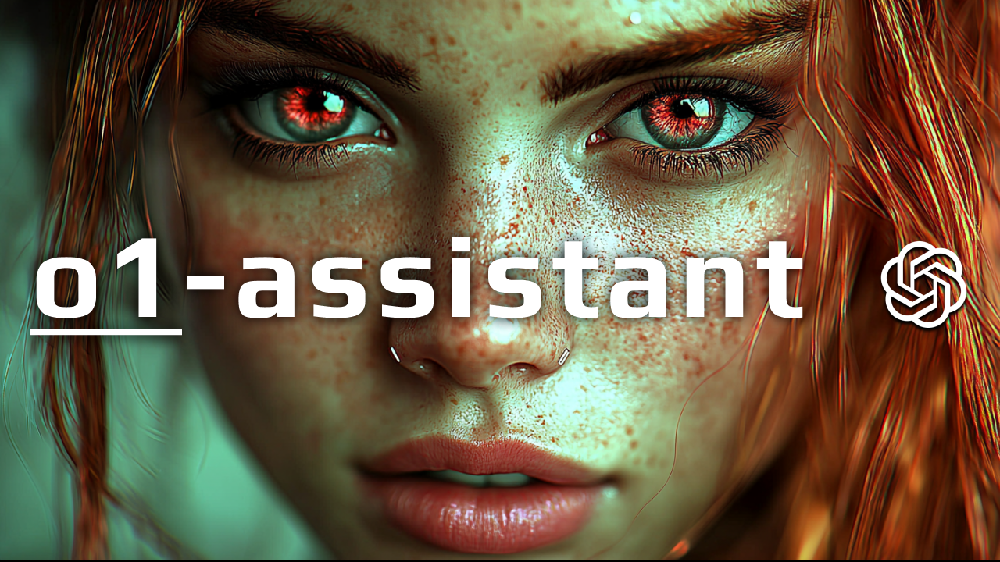

# POC Python Realtime API o1 assistant
> This is a proof of concept for using the OpenAI's [Realtime API](https://openai.com/index/introducing-the-realtime-api/) to chain tools, call o1-preview & o1-mini, [structure output](https://openai.com/index/introducing-structured-outputs-in-the-api/) responses, and glimpse into the future of **AI assistant powered engineering**.
>
> See video where we [use SQL methods and discuss AI engineering in 2025](https://youtu.be/4SnvMieJiuw)
>
> See video where we [use and discuss this POC](https://youtu.be/vN0t-kcPOXo)
>
> See video where we [add memory and tools to the assistant](https://youtu.be/090oR--s__8)
>
> This codebase is a v0.3, poc. It's buggy, but contains the core ideas for realtime personal ai assistants & AI Agents.




## Setup
- [Install uv](https://docs.astral.sh/uv/), the hyper modern Python package manager.
- Setup environment `cp .env.sample .env` add your `OPENAI_API_KEY` and a `FIRECRAWL_API_KEY` for scraping.
- Update `personalization.json` to fit your setup
- Install dependencies `uv sync`
- Run the realtime assistant `uv run main` or `uv run main --prompts "Hello, how are you?|What time is it?|Open Hacker News"`

## Assistant Tools
> See [TOOLS.md](TOOLS.md) for a detailed list of available tools and their descriptions.

## Personalization

You can customize the behavior of the assistant by modifying the `personalization.json` file. Here are the available options:

- `browser_urls`: A list of URLs that the assistant can open in the browser.
- `browser_command`: The command used to open the browser.
- `ai_assistant_name`: The name of the AI assistant.
- `human_name`: The name of the human user.
- `sql_dialect`: The SQL dialect to use for database operations. Supported options are:
  - `sqlite`: For SQLite databases
  - `postgres`: For PostgreSQL databases (untested)
  - `duckdb`: For DuckDB databases
- `system_message_suffix`: A string that will be appended to the end of the system instructions for the AI assistant.

Example `personalization.json`:

```json
{
  "browser_urls": [
    "https://chat.openai.com",
    "https://github.com",
    "https://stackoverflow.com"
  ],
  "browser_command": "open -a 'Google Chrome'",
  "ai_assistant_name": "Ada",
  "human_name": "User",
  "sql_dialect": "sqlite",
  "system_message_suffix": "Always be helpful and concise in your responses."
}
```

The `system_message_suffix` allows you to add custom instructions or personality traits to your AI assistant. This suffix will be appended to the end of the default system instructions, giving you more control over how the assistant behaves and responds.

## Try This

### Voice Commands
Here are some voice commands you can try with the assistant:

- "Hey Ada, how are you?"
- "What's the current time?"
- "Generate a random number."
- "Open ChatGPT, Claude, and Hacker News."
- "Create a new CSV file called user analytics with 10 mock rows."
- "Update the user analytics file, add 20 additional mock rows, use a reasoning model."
- "Get the current time, then add the current time to memory with the key 'current_time'."
- "Hey Ada, generate a diagram outlining the architecture of a minimal tiktok clone."
- "Hey Ada, check if `example.py` is runnable."
- "Hey Ada, run `example.py`."
- "Hey Ada, load the tables into memory.|Ada ingest active memory.|Ada select all Users"

### CLI Text Prompts
You can also pass text prompts to the assistant via the CLI.
Use '|' to separate prompts to chain commands.

- `uv run main --prompts "Hello, how are you?"`
- `uv run main --prompts "Open Hacker News"`
- `uv run main --prompts "Hey Ada!|What time is it?|Open Hacker News|Open Simon Willison blog|Open Aider"`
- `uv run main --prompts "copy my current clipboard to memory"`
- `uv run main --prompts "copy my current clipboard to memory with the key 'url'"`
- `uv run main --prompts "call remove_variable_from_memory to delete the clipboard_content variable from active memory"`
- `uv run main --prompts "Create a new CSV file called user analytics with 10 mock rows."`
- `uv run main --prompts "read file user analytics into memory"`
- `uv run main --prompts "reset active memory"`
- `uv run main --prompts "add to memory the key 'project_status' with the value 'in progress'"`
- `uv run main --prompts "read all files in the scratch pad directory into memory"`
- `uv run main --prompts "scrape the URL from my clipboard and save it to a file"`
- `uv run main --prompts "ada update the openai_structured_outputs file. clean it up and focus on the coding examples and the key usecases of structured outputs. use a fast model"`
- `uv run main --prompts "Generate a diagram outlining the architecture of a minimal tiktok clone"`
- `uv run main --prompts "Check if example.py is runnable code"`
- `uv run main --prompts "Run example.py"`
- `uv run main --prompts "Hey Ada, load the tables into memory|Ada ingest active memory|Ada execute sql select all Users and save to csv file"`

## Code Breakdown

### Code Organization
The codebase is organized within the `src/realtime_api_async_python` directory. The application is modularized, with core functionality divided into separate Python modules located in the `modules/` directory. Tests are located in the `tests/` directory, providing a starting point for testing the application's components.

### Important Files and Directories
- **`main.py`**: This is the entry point of the application. It sets up the WebSocket connection, handles audio input/output, and manages the interaction between the user and the AI assistant.
- **`modules/` Directory**: Contains various modules handling different functionalities of the assistant:
  - `audio.py`: Handles audio playback, including adding silence padding to prevent audio clipping.
  - `async_microphone.py`: Manages asynchronous audio input from the microphone.
  - `database.py`: Provides database interfaces for different SQL dialects (e.g., SQLite, DuckDB, PostgreSQL) and executes SQL queries.
  - `llm.py`: Interfaces with language models, including functions for structured output parsing and chat prompts.
  - `logging.py`: Configures logging for the application using Rich for formatted and colorful logs.
  - `memory_management.py`: Manages the assistant's memory with operations to create, read, update, and delete memory entries.
  - `mermaid.py`: Generates Mermaid diagrams based on prompts and renders them as images.
  - `tools.py`: Contains definitions of tools and functions that the assistant can use to perform various actions.
  - `utils.py`: Provides utility functions used across the application, such as timing decorators, model enumerations, audio configurations, and helper methods.
- **`tests/` Directory**: Contains tests for the application's modules, providing a starting point for testing the application's components.
- **`active_memory.json`**: Stores the assistant's active memory state, allowing it to persist information between interactions.
- **`personalization.json`**: Contains configuration settings used to personalize the assistant's behavior.
- **`db/` Directory**: Holds mock database files and SQL scripts for testing database functionalities.
- **`scratchpad/` Directory**: Used for temporary file storage and manipulation by the assistant.

### Memory Management
The assistant uses the `MemoryManager` class in `memory_management.py` to handle memory operations. This class provides methods to create, read, update, delete, and list memory entries. Memory is stored persistently in `active_memory.json`, enabling the assistant to access and manipulate memory across sessions.

### Tools Framework
Tools are functions defined in `modules/tools.py` that extend the assistant's capabilities. These tools are mapped in `function_map` and are available for the assistant to perform actions based on user requests. The assistant uses these tools to execute specific tasks, enhancing its functionality and allowing for dynamic interactions.

## Improvements
> Up for a challenge? Here are some ideas on how to improve the experience:

- Add interruption handling. Current version prevents it for simplicity.
- Add transcript logging.
- Make personalization.json a pydantic type.
- Let tools run in parallel.
- Fix audio randomly cutting out near the end.

## Mock Database (sqlite and duckdb)
- Reset duckdb `rm db/mock_duck.duckdb && duckdb db/mock_duck.duckdb < db/mock_data_for_duckdb.sql`
- Reset sqlite `rm db/mock_sqlite.db && sqlite3 db/mock_sqlite.db < db/mock_data_for_sqlite.sql`

## Resources
- https://youtu.be/4SnvMieJiuw
- https://youtu.be/vN0t-kcPOXo
- https://youtu.be/090oR--s__8
- https://www.firecrawl.dev/
- https://openai.com/index/introducing-the-realtime-api/
- https://openai.com/index/introducing-structured-outputs-in-the-api/
- https://platform.openai.com/docs/guides/realtime/events
- https://platform.openai.com/docs/api-reference/realtime-client-events/response-create
- https://platform.openai.com/playground/realtime
- https://github.com/Azure-Samples/aoai-realtime-audio-sdk/blob/main/README.md
- https://docs.astral.sh/uv/
- https://docs.astral.sh/uv/guides/scripts/#running-a-script-with-dependencies
- https://duckdb.org/docs/api/python/overview.html
- https://websockets.readthedocs.io/en/stable/index.html
- https://docs.python.org/3/library/sqlite3.html
